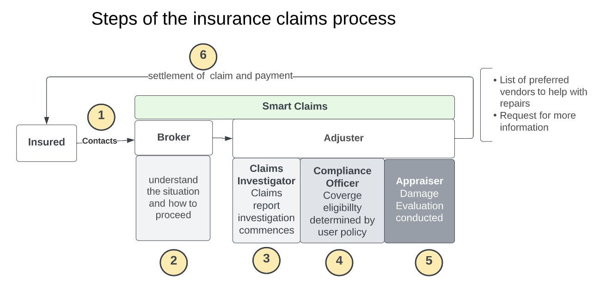
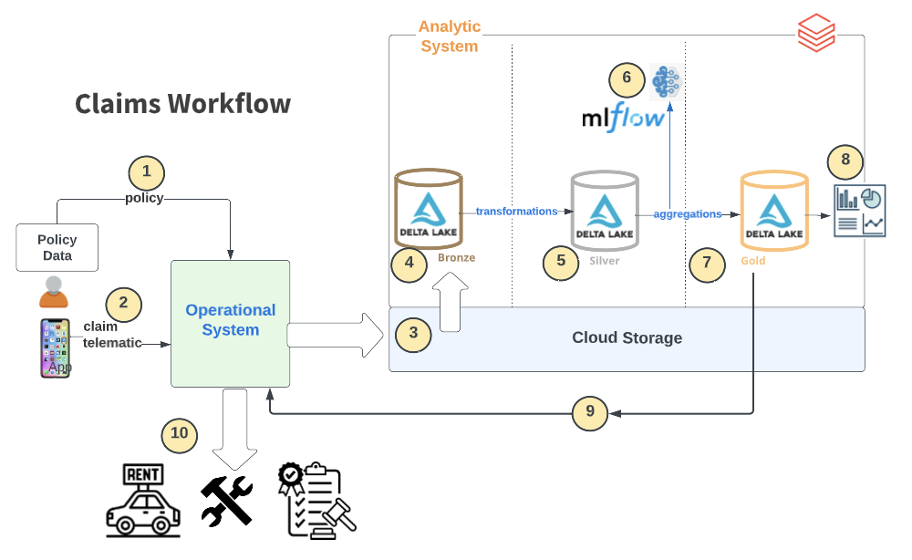
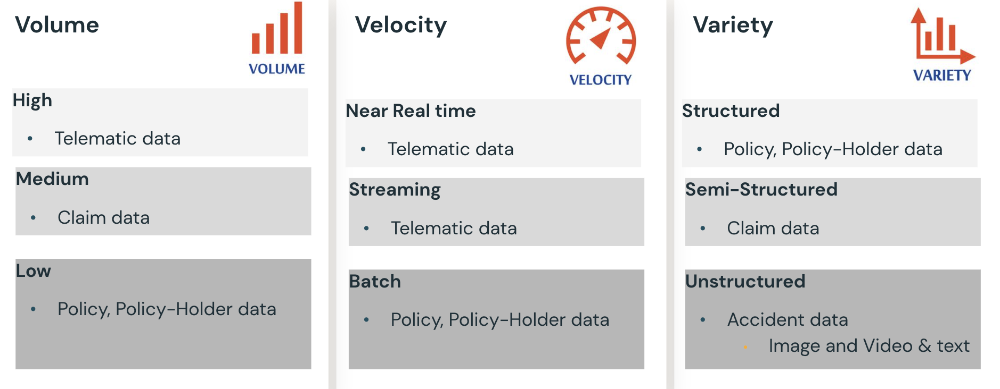
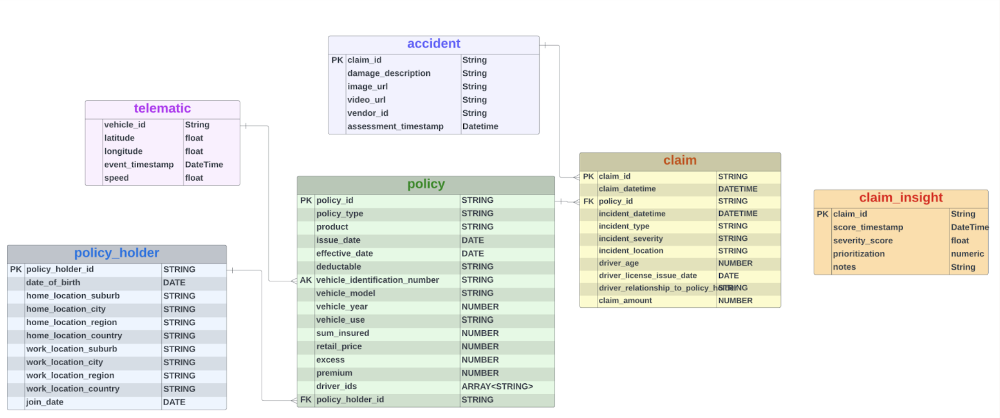
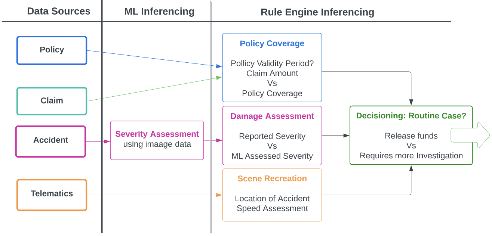
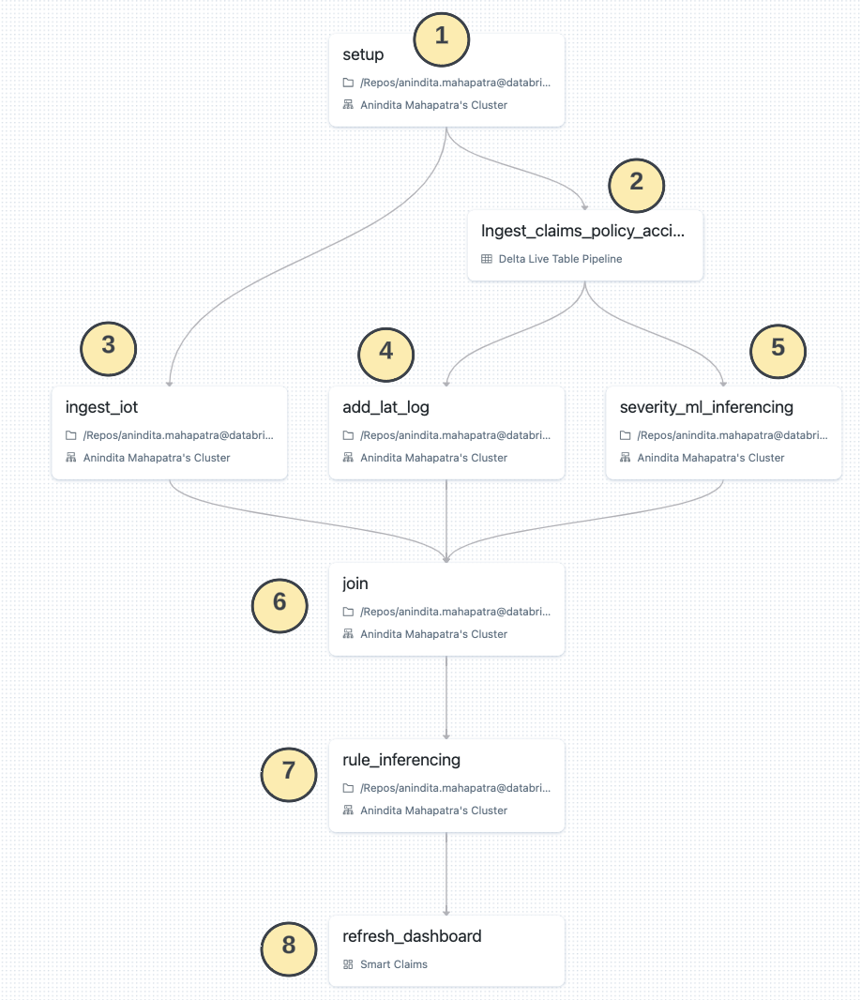
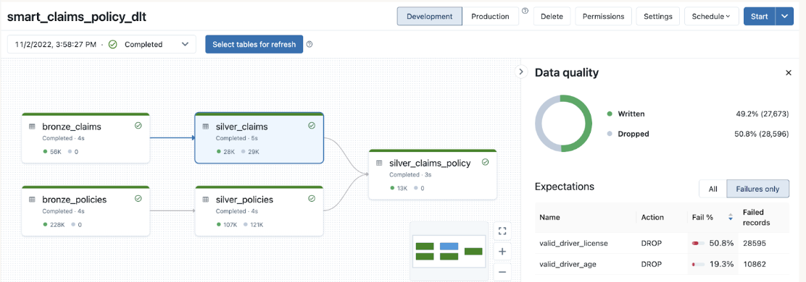
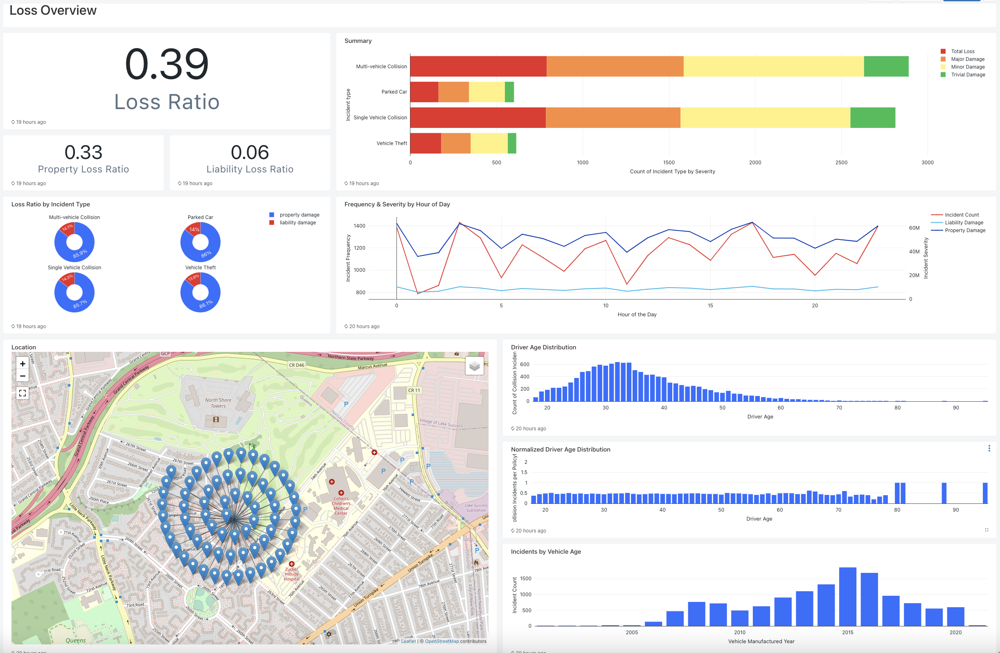

* <b>Domain </b>: Insurance 
* <b>Challenge </b>: 
  * Insurance companies have to constantly innovate to beat competition
  * Customer Retention & Loyalty can be challenge as people are always shopping for more competitive rates leading to churn
  * Fraudulent transactions can erode profit margins 
  * Processing Claims which can be very time consuming at times
  * How to improve the Claims Management process for faster claims settlement, lower claims processing costs and quicker identification of possible fraud.
* <b> Solution: Smart Claims! </b>
  * A Databricks Solution Accelerator that uses the Lakehouse paradigm to automate certain components of this process that aids human investigation 
  * Please refer to the getting started doc in the docs

Every claim is different, the following steps capturess a typical workflow  
1. The <b>Insured</b> contacts the broker who is the primary contact w.r.t. policy  
2. The <b>Broker</b> examines the data to ensure that relevant details of the claim situation have been captured  
The <b>Adjuster</b> takes over the investigation and may collaborate with internal/external experts to determine the amount of loss or damages covered by the insurance policy. 
 3. The <b>Claims Investigator</b> will do due diligence on the paperwork 
 4. The <b>Compliance Officer</b> will check eligibility of coverage and ensure no foul play is involved 
 5. The <b>Appraiser</b> will conduct a damage evaluation to determine the severity of the claim 
6. The <b>Adjuster</b> will ensure payment is approved and released and communicates back to the <b>Insured</b> 

___

# Details
* <b>What</b>
  * How to manage operational costs so as to offer lower premiums, be competitive & yet remain profitable?
  * How can customer loyalty & retention be improved to reduce churn?
  * How to improve process efficiencies to reduce the response time to customers on the status/decision on their claims?
  * How can funds and resources be released in a timely manner to deserving parties?
  * How can suspicious activities be flagged for further investigation?
* <b>Why</b>
  * Faster approvals leads to Better Customer NPS scores and Lower Operating expenses
  * Detecting & Preventing fraudulent scenarios leaads to Lower Leakage ratio
  * Improving customer satisfaction leads to Lower Loss ratio
* <b>How: Claims Automation</b>
  * Automting certain aspects of the claims processing pipeline to reduce dependence of human personnel esspecially in mundane predictable tasks
  * Augmenting additional info/insights to existing claims data to aid/expedite human investigation, eg. Recommend Next Best Action
  * Providing greater explainability of the sitution/case for better decision making in the human workflow
  * Serving as a sounding board to avoid human error/bias as well as providing an audit trail for personel in Claims Roles 

# Emerging trends in Insurance 
* According to EY: 'It is given that the future of insurance will be <b>data-driven</b> and <b>analytics-enabled</b>. But tomorrow’s top-performing insurers will also excel at making <b>human connections</b> and applying the personal touch at the right time.'
* Deloitte in its '2023 Insurance outlook' states 'Technology infrastructure has improved, but focus needs to shift to <b>value realization</b>, and broaden  historical focus from risk and cost reduction to prioritize greater levels of experimentation and risk-taking that drives ongoing innovation, competitive differentiation, and profitable growth.' with increased focus on ESG as value differentiator & DEI to broaden offerings.
* Nationwide CTO, Jim Fowler in a podcast on 'Future of Insurance' summarized it aroud <b>Innovation</b>. 
* Each individual need is different. Hence personalization and delivering the relevant value to the concerned individual is an importaant ingredient to inovate. Personalization is not about bothering the customer with multiple touchpoints but wowing them with relevant insights that suit their need in a timely manner. 
* Apart from courage and conviction, Innovation requires patience because no worthy change is delivered overnight. Hence the need to be on a platform that enables fast paced innovation and an architecture that is open, extensible and pluggable so that technology is never a constraint nor a hindrance to execution of novel ideas. 

# Smart Claims Reference Architecture & Data Flow

Claims flow typically involve some orchestration between an <b>operational</b> system such as Guidewire and an <b>analytic</b> system such as Databricks as shown in the diagram above. End users often use a smart app to file claims, look at the status of their case. Either via an app or an IoT dvice embedded in their vehicle, telematic data iss constantly streaming into one of these two systems which provides a lot of information regarding their driving patterns. Sometimes in the event of other credit scores, this data is used to assign a risk score for the driver which has a direct consequence on their premiums. In some ways, it can be argued that this type of <b>insurance risk score </b> is a better indicator of a person's safety track rather than a generic financial credit score which is determined primarily by their financial track record. 

1. Policy data ingestion 
2. Claims and telematics data ingestion 
3. Ingest all data sources to the cloud storage
4. Incrementally Load Raw data to Delta Bronze table
5. Transform and Manipulate data
6. Model scoring (and model training in the training pipeline)
7. Load predictions to a gold table and perform aggregations
8. Dashboard visualization
9. Feed the results back to the operational system
10. Claims routing based on decision

___

# Datasets
* All the data is synthetically generated data including the images and geo locations

* Typical datasets include the above, some of these are slow moving while others are fast moving. 
* Some are strutured/semi-structured while others are un-structed. 
* Some of these are additive and are appended while others are inccremental updates and are treated as slowly changing dimensions.

___

# Domain Model

* There are several industry prescribed data domain models Eg. OMG (https://www.omg.org/) 
* The above diagram is a simplified domain model to capture some of the relevant data points for the use case.
* For more details, efer to the P&C etity definitions, terminology & logicaal model https://www.omg.org/spec/PC/1.0/PDF

# Insight Generation using ML & Rule Engine 
* A pre-trained <b>ML Model</b> is used to score the image attached in the claims record to assess the severity of damage.
* A <b>Rule Engine </b> is a flexible way to define known operational static checks that can be applied without requiring a human in the loop, thereby speeding up 'routine cases'. When the reported data does not comply with auto detected info, flags are raised to involve additional human investigation
* This additional info helps a claims investigator by narrowing down the number of cases that need intervention a well as by narrowing down the specific areas that need additional follow up and scrutiny
* Some common checks include
  * Claim date should be within coverage period
  * Reported Severity should match ML predicted severity
  * Accident Location as reported by telematics data should match the location as reported in claim
  * Speed limit as reported by telematics should be within speed limits of that region if there is a dispute on who was on the offense 

# Workflow
* Different data sources flow in at their own pace, some independent, some with dependencies
* We will use Databricks multi-task Workflows to put the process in auto-pilot mode to demonstrate the Lakehouse paradigm.
* Some nodes are Delta Live Table nodes which employ the medallion architecture to refine and curate data, while others are notebooks which use a Model to score the data while still others are SQL workflows to refresh a dashboard with newly generated insights.

1. Setup involve all the work needed to setup the  
2. Ingest claims, Policy & accident data ussing a DLT Pipeline  
3. Ingest Telematic data  
4. Augment claims data with latitude/longitude using zipcode  
5. Apply ML model to incoming image data to auto infer severity  
6. Join telematics data with claims data to recreaate scene of accident eg. location, speed. This is where other 3rd party dta can be layered ex. road conditions, weather data, etc.  
7. Apply pre-determined rules dynamically to assess merit of the claim and if it is a 'normal' case, release of funds can be expedited  
8. Claims Dashboard is refreshed to aid claim investigators with additional data insights inferenced through the data and AI pipeline  

                                                                                   
Using DLT for ETL helps simplify and operationalize the pipeline with its support for autoloader, data quality via constraints, efficient auto-scaling for streaming workloads, resiliency via restart on failure, execution of administrative operations among others.

* Schema: smart_claims
* Tables:
  * <b>Bronze:</b> bronze_claim, bronze_policy, bronze_accident
  * <b>Silver:</b> silver_claim, silver_policy,  silver_claim_policy, silver_telematics, silver_accident, silver_claim_policy_accident, silver_claim_policy_telematics, silver_claim_policy_location
  * <b>Gold:</b> claim_rules, gold_insights
___

# Insight visualization using Dashboards
A <b>Loss Summary</b> dashboard gives a birds eye view to overall business operations 

* <b>Loss Ratio</b> is computed by insurance claims paid plus adjustment expenses divided by total earned premiums. 
  * For example, if a company pays $80 in claims for every $160 in collected premiums, the loss ratio would be 50%. 
  * The lower the ratio, the more profitable the insurance company. Each insurance company has its target loss ratio. A typical range is between 40%-60%. 
  * Damage is captured in 2 categories - property & liability - their loss ratios are tracked separately
  * The 80/20 Rule generally requires insurance companies to spend at least 80% of the money they take in from premiums on care costs and quality improvement activities. The other 20% can go to administrative, overhead, and marketing costs.
* <b>Summary</b> visualization captures count of incident type by severity
  * <b>Incident type</b> refers to damage on account of 
    * theft, collision (at rest, in motion (single/multiple vehicle collision)
  * <b>Damage Severity</b> is categorized as trivial, minor, major, total loss
* Analyzing recent trends helps to prepare for handling similar claims in the near future, for Eg.
  * What is the frequency of incident/damage amount by hour of day 
    * Are there certain times in a day such as peak hours that are more prone to incidents?
  * Is there a corelation to the age of the driver and the normalized age of the driver 
    * Note there are very few driver below or above a certain threshold
  * What about the number of incident coreelated to the age/make of the vehicle.
  * Which areas of the city have a higher incidence rate(construction, congestion, layout, density, etc)

A per claim <b>Investigation</b> dashboard gives additional where a claims officer picks a claim number and can drill into its various facets 

* The first panel uses <b>counter</b> widgets to provide statistics on rolling counts on number of 
  * Claims filed and of those how many were flagged as 
    * suspicious or 
    * had expired policies or
    * had a severity assessment mimatch or
    * claims amount exceeded the policy limits
* The next widget uses a <b>table</b> view to provide recent claims that are auto scored in the pipeline  using ML iferecing and rule engine
  * A green tick is used to denote auto-assessmentt matches claims description
  * A red cross indicates a mismatch that warrants further manual investigation
* Drill down to a specific claim to see
  * Images of the damaged vehicle 
  * Claim, Policy & Driver details 
  * Telematic data draws the path taken by the vehicle 
  * Reported data is contrasted with assessed data insights
___
# Databricks value proposition in Smart Claims?
* Databricks features used
  * Delta, DLT, Multitask-workflows, ML & MLFlow, DBSQL Queries & Dashboards
* Unified Lakehouse architecture for
  * All data personas to work collaboratively on a single platform contributing to a single pipeline
  * All big data architecture paradigms including streaming, ML, BI, DE & Ops
* Workflow Pipelines are easier to create, monitor and maintain
  * Multi-task Workflows accommodate multiple node types (notebooks, DLT, ML tasks, QL dashboard and support repair&run & compute sharing)
  * DLT pipelines offer quality constraints and faster path to flip dev workloads to production
  * Robust, Scalable and fully automated via REST APIs thereby improving team agility and productivity
* BI & AI workloads 
  * Created, managed with MLFlow for easy reproducibility and auditability
  * Supports any model either created or ported 
  * Parameterized Dashboards that can access all data in the Laake and can be setup in minutes
___
# How best to use this demo? 
* Ideal time: 1 hour (see recorded demo, deck, field-demo link)
* Ideal audience: Mix of tech and business folks (Basic Databricks knowhow is assumed)
* For optimum experience, reduce cluster startup times by having a running ML Runtime Interactive cluster, DBSQL Warehouse, DLT in dev mode
* Ideal Flow:
  * Explain need for claims automation via 'smart claims' & how Lakehouse aids the process 
  * Deck: based on this Readme, set the flow of the story (15 min)
  * Discovery of where they are (10 min)
  * Demo (25 min)
    * Data sources & EDA notebooks                                                                          
    * DE: Workflow & DLT Pipeline (5 min)
    * ML: Model management & inferencing (5 min)
    * BI: Loss summary & Claims Investigation (10 min)
 * Next steps (5 min)
___
<anindita.mahapatra@databricks.com>  
<marzi.rasooli@databricks.com>  
<sara.slone@databricks.com>  
___

&copy; 2022 Databricks, Inc. All rights reserved. The source in this notebook is provided subject to the Databricks License [https://databricks.com/db-license-source].  All included or referenced third party libraries are subject to the licenses set forth below.

| library                                | description             | license    | source                                              |
|----------------------------------------|-------------------------|------------|-----------------------------------------------------|
| PyYAML                                 | Reading Yaml files      | MIT        | https://github.com/yaml/pyyaml                      |

